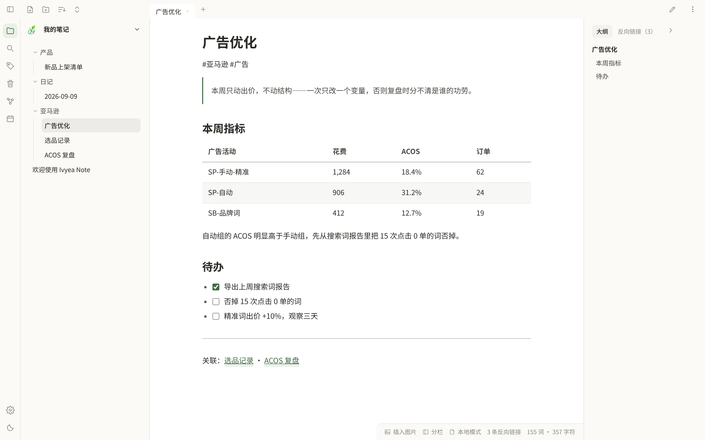
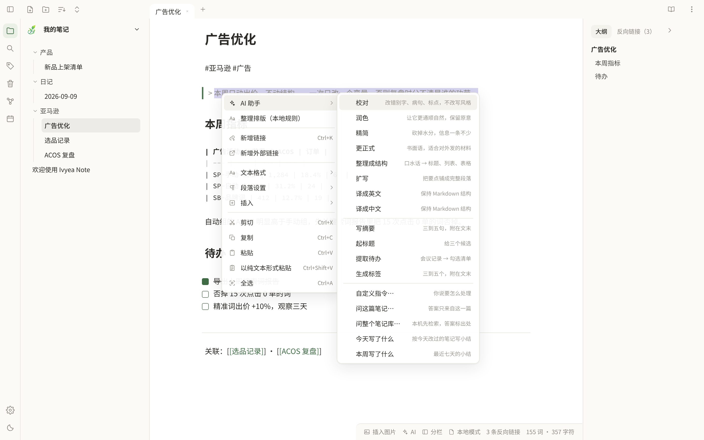

# Ivyea Note

**本地优先的 Markdown 笔记软件，自带同步服务器。**
笔记永远是你磁盘上的普通 `.md` 文件；服务器只做加密可靠的同步管道；任何一端离线都能完整工作。

桌面端（Windows / macOS / Linux）、安卓 App、以及由同步服务端自己托管的网页版，**共用同一份代码**。

AI 是**可选的**：接你自己的 OpenAI 兼容接口，不配就完全不联网；开了也只发你选中的那段，结果先给对照再决定写不写。



---

## 交流与反馈

欢迎扫码加入微信群，反馈 Bug、交流 Ivyea Note 使用经验、AI 工具与亚马逊运营相关知识。**也欢迎提改进建议**——功能需求、交互优化、文档纠错都行，可在群里直接说，或到 GitHub 提 [Issue](https://github.com/Hector-xue/IvyeaNote/issues) / PR。群二维码可能会过期；如果扫码失效，可先关注公众号，再获取最新群二维码。

<table>
  <tr>
    <td align="center" width="50%">
      
      <br />
      <strong>微信群：Ivyea 的精神股东们</strong>
      <br />
      <sub>反馈 Bug / 交流 AI 与运营 / 提改进建议</sub>
    </td>
    <td align="center" width="50%">
      
      <br />
      <strong>公众号</strong>
      <br />
      <sub>群二维码失效时，关注后获取最新版</sub>
    </td>
  </tr>
</table>

---

## 为什么会有它

Obsidian 很好，但官方同步收费且封闭。这个项目想要的是同一套体验加上两件事：**数据完全自持**，**同步不求人**。

于是它长成了这样：

- **笔记就是文件。** 卸载软件，你的 `.md` 还在原地，用记事本、VSCode、Obsidian 都能打开。没有私有格式，没有数据库锁定。
- **同步服务器一个 exe 就能跑。** 默认 SQLite，密钥和账号自动生成，不需要 Docker、不需要域名。桌面端甚至**内置**了它——设置里一个开关，这台电脑就是你的同步服务器。
- **没有"官方服务器"。** 公开安装包里不预置任何人的域名，你连到哪台机器完全由你决定。

---

## 下载

到 [**Releases**](https://github.com/Hector-xue/IvyeaNote/releases/latest) 取对应平台的包：

| 平台 | 文件 | 说明 |
|---|---|---|
| Windows | `Ivyea.Note_*_x64-setup.exe` | 安装即用，含内置同步服务端 |
| macOS (Apple Silicon) | `Ivyea.Note_*_aarch64.dmg` | |
| macOS (Intel) | `Ivyea.Note_*_x64.dmg` | |
| Linux | `Ivyea.Note_*_amd64.deb` / `.AppImage` | |
| 安卓 | `Ivyea.Note_*_universal.apk` | 通用包，无需挑架构 |
| 服务端 | `ivnote-server-<os>-<arch>` | 单文件二进制，六个平台 |

桌面端有**应用内更新**：有新版时会提示，点一下装完重启即可。

---

## 三种用法，按需选一种

**① 单机本地模式（零配置）**
装上就能写。笔记存在你选的文件夹里，不联网、不注册。想同步了随时再开。

**② 把这台电脑当服务器（Windows + 手机的主场景）**
设置 → 同步 → 「在这台电脑上开启同步」。它会拉起内置服务端、自动建账号并登录，然后给一个 **6 位配对码**；手机上打开 App 输入这 6 位数字就连上了——不用输地址、不用输密码、不用注册。
适合「电脑常开、手机随时同步」。电脑关机时同步暂停，笔记不会丢。

> 手机连不上时，去 **设置 → 同步 → 连接诊断**：它会逐条告诉你卡在哪一关（服务端在不在跑 / Windows 防火墙放没放行 / 手机该填哪个地址 / 是不是不在同一网段），能修的直接给按钮。

**③ 自建一台常开的服务器**
想要「电脑关机手机也能同步」，就把服务端放到一台常开的机器上。见下。

---

## 自建服务器

服务端是一个 Go 程序，**默认后端就是 SQLite**，密钥与管理员账号会自动生成。

**最简：单文件跑起来**

```bash
# 从 Releases 下 ivnote-server-linux-amd64
chmod +x ivnote-server-linux-amd64
IVNOTE_LISTEN=:8080 ./ivnote-server-linux-amd64
```

打开 `http://<你的地址>:8080/` 是状态页，`/app/` 就是网页版。

**要上生产（TLS、Postgres、备份）**

```bash
IVNOTE_DOMAIN=note.example.com sudo -E deploy/install.sh
```

首次运行会从 `deploy/.env.example` 生成 `deploy/.env`，**自动生成全部密钥与管理员密码**（写进 `.env`，不只是打印在日志里）。栈是 docker compose（app + Postgres），TLS 由宿主 nginx 终结。

⚠️ 用 Postgres 时 `deploy/docker-compose.yml` 里**必须显式设 `IVNOTE_DB: postgres`**——只设 `IVNOTE_DATABASE_URL` 它仍会去开 SQLite。

主要端点：`/`（状态页）、`/app/`（网页版）、`/admin`（管理页）、`/api/v1/*`、`/ws`、`/mcp`、`/healthz`。

---

## 能做什么

**写作**
实时预览（编辑态直接渲染标题/加粗/引用/表格/callout/脚注/分隔线/**图片**）· 阅读模式 · 左右分栏 · 内联标题（文件名即标题）· 软换行 · 文内查找替换 · 编辑区完整右键菜单（文本格式 / 段落设置 / 插入 三个二级菜单）· 格式快捷键 · 中文排版规则（标题不用负字距、只用两档字重）

**组织**
多层文件树（显示库里全部文件，非 Markdown 带类型角标）· 拖拽移动（可撤销）· **标签页**（侧栏点笔记在当前标签里换，Ctrl / 中键才新开，顶栏 `+` 是新标签页）· `[[双链]]` 与补全 · 反向链接 · 大纲 · **标签与回收站都是左栏的面板** · 模板 · 每日笔记（ribbon 上的日历图标）· Obsidian `.base` 表格视图 · 从 Obsidian 一键导入

**检索**
倒排索引 + BM25（不是全文 `includes` 扫）· 中文二元组分词 · 命令面板 · 侧栏搜索带上下文预览 · 快速切换

**图谱**
开在主区（和正文并排切换，不是一个要退出去才能回来的整屏页面）· 力导向布局，可缩放 / 平移 / 拖节点 · 搜索过滤与悬停聚焦 · 局部图可调跳数 · `[[双链]]` 和普通 Markdown 链接都算边

**附件与导出**
拖入/粘贴图片自动落盘并插入引用 · 附件位置可选（跟随笔记 / 统一目录）· **应用内 PDF 阅读器**（pdf.js，按需渲染 / 页码 / 缩放，三端一致）· 图片全屏查看 · **应用内看 HTML**（不跳浏览器；默认沙箱不跑脚本；手机上给电脑做的页面会自动重排成一栏，字号不缩）· **HTML 工具能直接用**：带脚本的页面点一下「运行脚本」就在隔离沙箱里跑（碰不到笔记和账号），工具存的数据落到同名 `.data.json` 随笔记同步，手机电脑打开是同一份台账· **导出为 PDF**：选个位置直接出文件，不经打印机，输出是矢量的（文字可选中可搜索）

**同步**
增量 push/pull · 三方 diff3 合并 · 冲突副本不覆盖 · 删改复活 · 墓碑去重 · WebSocket 实时触发 + 30 秒兜底轮询 · 同步状态面板说得出「现在还差什么」

**不会因为换位置丢东西**
账本跟着位置走：换了库文件夹 / 授权失效 / 卡拔了，同步引擎按"新设备"重新对账，只会让文件变多不会变少 · **删除熔断**：本地一下少了一大批时不推删除，状态栏变红，面板里一键从云端拉回来 · 新建笔记库 = 选一个文件夹，库名就是文件夹名；库能切、能删（文件一个不碰）

**找回**
**文件历史**（右栏「历史」标签 / 手机「⋯」）：每次写盘前留一张本机快照（5 分钟一张、留 30 天，不登录也有）+ 云端每一版（服务端从不删旧版），选一版看对照、一键恢复，恢复前那版也留底 · **别的设备删掉的**同步过来先进本机回收站，而不是直接消失 · 回收站里还有「云端已删除」一段，换了台新机器也能把删掉的文件找回来

**AI（可选，接你自己的模型）**
配置就是 `接口地址 + Key + 模型名`三件套，任何 **OpenAI 兼容**接口都能用（官方、中转、或本机的 Ollama / LM Studio）。**不配就完全不联网**，所有 AI 入口只是灰着。
入口在编辑区右键第一项、状态栏那颗「AI」、手机端「⋯」和命令面板。二十件事按**它会对你的文件做什么**分四段：

| 会改你选中的字 | 只多给一段东西 | 你自己存的 | 一个字都不写 |
| --- | --- | --- | --- |
| 校对 · 润色 · 精简 · 更正式 · 整理成结构 · 扩写 · 译成英文 · 译成中文 | 写摘要 · 起标题 · 提取待办 · 生成标签（写进 frontmatter） | 自定义动作（存下你那句原话，和内置的并排） | 自定义指令 · 问这篇笔记 · **问整个笔记库** · 今天/本周写了什么 |



三条不让步的规矩：

1. **默认只发你选中的那段**。没选中就想校对？直接拒绝并说明——绝不默认把整篇笔记发出去。
2. **结果先给对照，笔记一个字不动**。左右 diff 看清改了哪几行，点「应用」才写回。
3. **改动进编辑器的撤销栈**，Ctrl+Z 能把 AI 的修改退回去。

「问整个笔记库」**在本机检索**（倒排打分 + 按行截取最相关的那一段），只把最相关的最多 5 篇、约 6000 字发出去，面板上如实写着送了哪几篇、多少字；答案要标 `[[出处]]`，点得回原文，查不到就直说查不到。

排版这类活**不交给模型**：中英文空格、标点全角半角、列表符号、标题层级，以及按内容自动选字号/行宽/行高，都是纯本地规则——离线、瞬时、同一篇每次结果一样。

**外观**
浅色/深色 · 字体与字号自定义 · 可拖拽调宽的侧栏与右栏 · Windows 上无边框圆角窗口

**安卓桌面入口**
长按图标：新建笔记 · 今日日记 · 最近打开的两篇 · 五种桌面小部件：**笔记卡片**（2×2 起可拉伸，一篇笔记的标题 / 正文 / 修改时间，点一下接着写；默认最近一篇，笔记「⋯」→「添加到桌面」可钉指定的一篇）· **快速记录**（2×2）· **快捷创建**（2×1）· **最近笔记**（4×2 起）· **待办**（4×2 起，笔记里没完成的 `- [ ]` 在桌面上直接勾掉）

**给 Agent 用**
服务端带 MCP endpoint，笔记库可以直接当 Agent 的读写终端。见 [`docs/Agent接入-MCP.md`](docs/Agent接入-MCP.md)。

---

## 文档

- [使用指南（网页版 / 桌面端 / 部署）](docs/使用指南-Web与桌面端.md)
- [Agent 接入（MCP）](docs/Agent接入-MCP.md)
- [同步协议与一致性场景](shared/protocol.md)
- [版本变更记录](CHANGELOG.md)

---

## 开发

```
desktop/    桌面端 + 安卓端（Tauri 2 + React + CodeMirror 6，同一份代码）
server/     Go 同步服务端（auth / vault / sync / blob / WS / MCP）
shared/     同步协议定义与一致性测试用例
deploy/     部署编排（Dockerfile / compose / install.sh）
scripts/    一致性测试等脚本
```

```bash
cd desktop
npm ci
npm run dev            # 浏览器里跑（OPFS 当本地库）
npm run tauri dev      # 桌面端
npm test               # vitest
npm run build && npm run verify:ui   # 真实产物 + headless Chrome 断言 computed 值并出截图
npm run shots -- /要放截图的目录     # 按当前产物重拍官网与 README 用的产品截图
```

```bash
cd server
go run ./cmd/ivnote-server     # 默认 SQLite，监听 :8080
scripts/conformance.sh         # 同步一致性场景 C1~C8
```

质量门禁（CI 与发版流水线共用）：`oxlint` + `tsc` + `vitest` + `vite build` + `cargo check` + `go vet/test`，任一不过不出包。
另有 `desktop-check`（Windows / macOS 的 `cargo check`，专门盯 `#[cfg(windows)]` 那类在 Linux 上根本不参与编译的代码）。

---

## 已知限制

- 安卓上选择系统目录依赖 SAF，大库遍历较慢；未绑定文件夹时笔记存在应用内部存储，**卸载会一起删掉**，务必先开同步。
- 「这台电脑当服务器」要求手机与电脑在同一局域网；路由器的 AP 隔离、访客 WiFi、双频独立子网都会挡住它（诊断面板会指出来）。
- 无边框圆角窗口目前只在 Windows 生效，macOS 保留原生红绿灯、Linux 保留原生边框。
- 代码块语法高亮尚未做。
- 「问整个笔记库」用的是**词法检索**（倒排 + 打分），问「降价」找不到只写了「打折」的那篇；本机零命中时会花一次极小的调用让模型给一串同义词再检索。语义向量检索尚未做。

---

## ☕ 请作者喝杯咖啡

Ivyea Note 是免费开源的，没有会员、没有内购，同步服务器也在你自己手里。如果它帮你把笔记安顿好了，欢迎请作者喝杯咖啡——一杯咖啡就是下个版本的动力。当然，点个 Star、提个 Issue、写篇使用心得，同样是很大的支持。

<table>
  <tr>
    <td align="center">
      
      <br />
      <strong>微信扫码 · 支持作者</strong>
      <br />
      <sub>金额随意，心意都收到了</sub>
    </td>
  </tr>
</table>

---

## 许可

[MIT](LICENSE)
